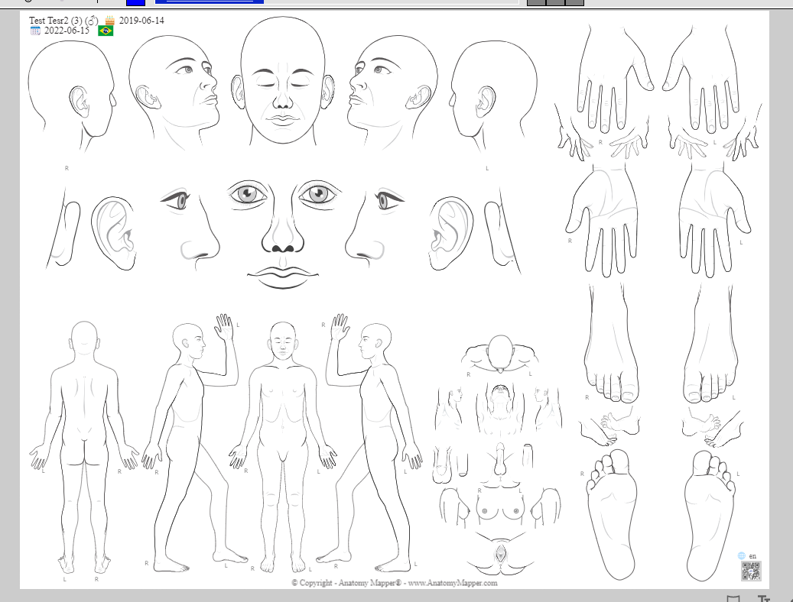
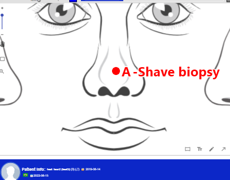
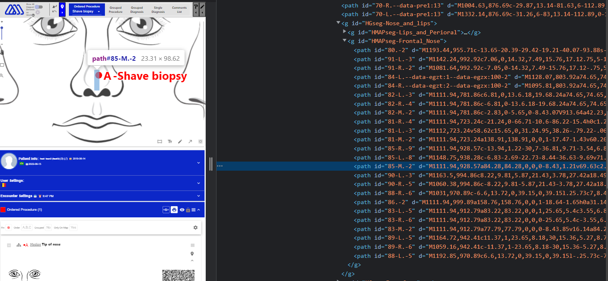
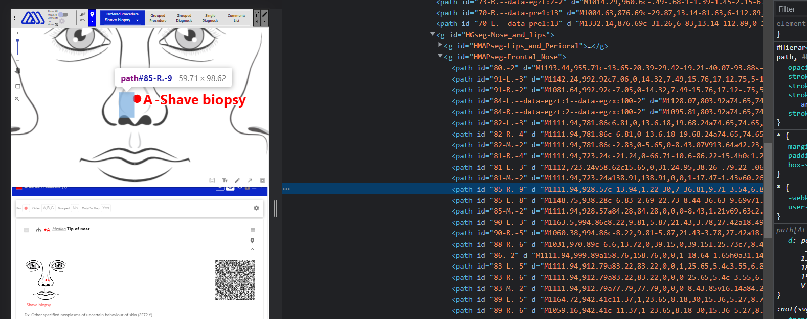
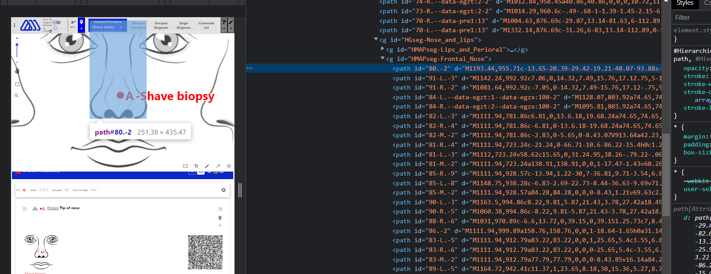
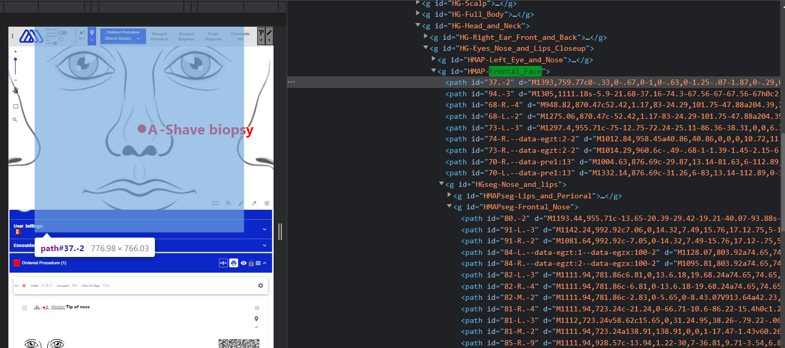

# Anatomy Mapper Documentation

This project is web application created using ReactJS.
This application will be used in medical field.
The doctor can mark different parts of the body and write notes for it. He can give specific diagnosis for that specific body part.

## Run Locally

Clone the project

```bash
  git clone https://github.com/pugaliapuneet/anatomy-mapper
```

Go to the project directory

```bash
  cd anatomy-mapper
```

Install dependencies

```bash
  npm install
```

Start the dev server

```bash
  npm run start
```

### NOTE

When you open the application. You will see a forbidden message.
To remove it.
Follow the below steps:

- Enter application url followed by ?secret=1t5a53cr3t123.
- For eg if you are running locally on port 3000
  then url will be localhost:3000/?secret=1t5a53cr3t123

## Modules of the Application

### SVG

- Anatomy SVG Dynamic Loader
- Drawing tools for SVG
- Color Coded Legends/ Hierarchial Selector
- Hover/ Touch Gestures/ Pan-Zoom Actions
- Pin Marker/ Region Marker (distribution list) on SVG Map
- Visual Definitions

### Naming Conventions

- Anatomic Site Related
  - SNS Configuration [For configuring global naming sequence for all anatomic sites to follow]
  - Name Builder [For changing names and implementing custom sns for pin items and distribution items]
  - Auto Related Same Name Implementation
- Other naming Conventions
  - File Name Builder

### Export Modules

- Print Blank Map.
- Export PDF with map along with lists.
- Export Lists as text file.
- Export marked up map only.

### Lists

- Pin Lists
  - Ordered List
  - Grouped Diagnosis List
  - Grouped Procedure List
  - Single Diagnosis List
  - Comments List
- Distribution Painter List
- Delete/ Restore List

### Lists and List items Related tools.

- Link Editor
- Pin Description Editor
- ICD11 Diagnosis Tool
- Meta Data Accordion [For dev info about anatomic Site]
- Hierarchial Selector
- List attributes such as order, color, pattern(distribution), opacity(distribution), grouped etc.
- QR Code Builder

### Language

- Language Switcher
- UI based on Language
- Modfiy map on change of Language
- Modify sns on change of Language
- Modifiers based on Language

### General Application Settings

- Patient Info
- Encounter Info
- User Settings
- Language Switcher

### Other Features

- Load using query strings.
- Local Storage Implementation for user settings and patient info.
- License / Privacy Policy Acceptance Modals.
- Anatomic Site Code Translator.

## Features

### Folder and File Structure.

- Main entry of the application is through [index.js](./src/index.js)
- [index.js](./src/index.js) renders [AppWrapper](./src/AppWrapper.js) component. This AppWrapper component is responsible to render [ProtectedApp](./src/ProtectedApp.js) or [UnprotectedApp](./src/AppWrapper.js#L4) based on avaibility of [App Secret](#app-secret)
- [ProtectedApp.js](./src/ProtectedApp.js) is responsible to render main app along with store, theme, translation and export provider.
- **Store Provider**: We are using redux. We have created a [global store](#global-store) using Redux.

  - Reducers along with actions can be found in [src/store](src/store/) directory.
  - [src/store/index.js](src/store/index.js), main reducer defined and redux boilerplate.
  - [src/store/slices](src/store/slices/), directory where we store [redux slices](https://redux-toolkit.js.org/api/createslice)
  - Current slices are
    - [lists](src/store/slices/lists.js) - Most important slice that stores and process list related information.
    - [app](src/store/slices/app.js) - Common app states are defined here.
    - [modals](src/store/slices/modals.js) - States of most of modal used in the application are defined here.
    - [userSettings](src/store/slices/userSettings.js) - Common settings of the application like user info, patient info, encounter info and other settings. This is a persistent. Means all the data is saved in localStorage.

- **Theme Provider**: We are using Material UI theming. Theming is defined in [ProtectedApp](./src/ProtectedApp.js#L41) itself.

- **Translation Provider**: This app supports multiple language. All the translation related code and hooks used in translation is defined in [translation.jsx](./src/contexts/translation.jsx).

- **Export Provider**: We use this provider to facilitate us with export functionalities in App. Main codebase can be found at [useExport.js](./src/hooks/useExport.js)

- [App.js](./src/App.js), this is where main application codebase starts.
- In App.js basic layout is we have following things:
  - Privacy, Terms And Condition Modal which is shown only when user visits first time or he unaccepts Privacy Policy.
  - **Header**: Header of the application can be found at [Header.jsx](./src/layouts/Header.jsx)
  - **SVG with Drawing Canvas**: Main codebase for SVG and Canvas can be found at [AnatomyMapperMain.js](./src/AnatomyMapperMain.js), [AnatomyMapper.js](./src/components/AnatomyMapper/index.js), [SketchField.jsx](./src/components/CustomMap/SketchField.jsx), [LoadSVG.js](./src/components/LoadSVG/index.js)
  - **Accordions**:
    - **PatientInfoAccordion**: Patient Info Form [PatientInfoAccordion.jsx](./src/components/PatientInfoAccordion/index.js),
    - **EncounterInfoAccordion**: Encounter Info Form [EncounterSettings.jsx](./src/components/EncounterSettings/EncounterSettings.jsx)
    - **UserSettingsAccordion**: User Settings Form [UserSettingsAccordion.jsx](./src/components/UserSettingsAccordion/UserSettingsAccordion.jsx)
    - **ListAccordion**: [ListRenderer/index.js](./src/components/ListsRenderer/index.js)
- All other components and modals used in application can be found at [src/components](src/components/)
- Some other important components.
  - Responsible for SVG Actions like click and hover: [AnatomyMapper.js](./src/components/AnatomyMapper/index.js)
  - Responsible for Pin and Region Rendering on SVG: [ItemRenderer/index.js](./src/components/ItemsRenderer/index.js)
  - Pinch, zoom and other drawing features. [SketchField.jsx](./src/components/CustomMap/SketchField.jsx)

### Translations

- This app supports multiple language.
- We are using backend apis to fetch different elemets of application based on language.
- We are using React Context API to manage language related state and to distribute it all over the app.
- Codebase can be found at src/context/language.jsx
- Backend APIs Used:
  - **General UI Translations** https://dev.anatomymapper.com/admin/public/api/am-translateui
  - **Anatomic Site Translations** https://dev.anatomymapper.com/admin/public/api/am-sites?index=285
  - **List of Languages** https://dev.anatomymapper.com/admin/public/api/am-languages
  - **Laterality Translations** https://dev.anatomymapper.com/admin/public/api/am-laterality
  - **Map Laterality Translations** https://dev.anatomymapper.com/admin/public/api/am-latlabels
  - **Countries List** https://dev.anatomymapper.com/admin/public/api/am-countries
  - **Anatomic Site Modifiers Translations** https://dev.anatomymapper.com/admin/public/api/am-policies
  - **EGZ Information Translations** https://dev.anatomymapper.com/admin/public/api/am-egzt
  - **Policies Translations** https://dev.anatomymapper.com/admin/public/api/am-policies
- Usage of backend API.
  - All these backend API accepts \***\*lang\*\*** as a params. (pass short language_code)
  - All these backend API responds with a data which is _base64_ encoded.
  - We have to decode the _base64_ response into _utf8_ text and then parse it to JSON to get usable results.
  - We have created a **useFetch** hook to abstract the above logic and to make our task of fetching and using api data simpler.
- Translation context expose following attributes which can be used anywhere in the API for translation related task.
  - **uiData**: General UI translation like data shown in toolbars, input labels, navbars, forms, modal etc.
  - **lateralityData**: modifiers array, laterality translations.
  - **tags**: Options available for tags dropdown and there translation
  - **languagesData**: List of available languages along with label and lanugage_code.
  - **anatomicData**: Anatomic Site Related Data for which we can use [amid](#amid) to index it.
  - **countriesList**: List of all available countries along with label, emoji code and alpha_2_code.
- We can use the translation hook to get all these attributes. See this for hook [usage](https://reactjs.org/docs/hooks-intro.html).
- We are exporting `useTranslations()` which can be used in following way.

```react
const {uiData} = useTranslations();
```

### SVG Structure and how we extract data from SVG

- Application uses a SVG which is dynamically loaded when a user opens the application. see [src/components/LoadSVG/index.js](src/components/LoadSVG/index.js)
  
- There are two important layer in svg.
  - **Base Image Layer**: Contains all the diagram of anatomic site.
  - **Hierarchy Layers**: Contains all hierarchy level layers present in anatomic site. When we hover or click on svg we get hierachy layer not base image.
  - Base Image does not contain any [pathId](#pathid). Hierarchy Layer contains all the anatomic site data. Base Image is used to get visual diagrams only.
- When user clicks or hover we extract following things
  - [pathId](#pathid)
  - [Hierarchy List](#hierarchy-list)
  - [Layer Info](#layer-info)

### EGZT Concept

- EGZ stands for Enhance granularity zone.
- EGZ helps us to find proper [enhance modifiers](#enhance_modifiers) according to deviation of a point from the center of an anatomic site.
- EGZ is determined by three terms.
  - **EGZT**: It helps to determine which set of modifiers to use.
  - **EGZX**: It helps to determine which deviation in x direction is applicable to have [enhance modifiers](#enhance_modifiers).
  - **EGZY**: It helps to determine which deviation in y direction is applicable to have [enhance modifiers](#enhance_modifiers).
- All these terms are extracted from [pathId](#pathId).
- [egztData](#translations) is a mapping of EGZT. Using egztData[egzt], we get which zone or which [enhance modifiers](#enhance_modifiers) to consider.
- Currently in codebase, see utils/cf.js/getEGZInfo and utils/cf.js/getEnhanceModifiers to see how we extract [enhance modifiers](#enhance_modifiers) using egz concepts.

### Global Store

- Recently we started working on a global store concept rather than using app internal state.
- Lot of features in our application are used in lot of place like Hierarchial Selector, PatientInfo, NameRenderer, Modals etc, rather than creating different component having different internal state. It's better to hook all the functionalities using a global store.
- This way we can avoid regression, remove code duplication, separate programming logic from the UI , makes app more consistent.
- Lot of work is already completed.
- Global store version of the app is in global-store branch.
- Right now, the immediate goal is to restore all the functionalities of main branch app into global-store app.
- This global store is implemented using [Redux](https://react-redux.js.org/tutorials/quick-start)
- Main thing to learn in react-redux is two things how to use useSelector to get state and how to use useDispatch to update state. This much information is sufficient for you to work on this project. See this for quick [tutorial](https://react-redux.js.org/tutorials/quick-start#use-redux-state-and-actions-in-react-components)
- One can also install [redux-dev tools extension](https://chrome.google.com/webstore/detail/redux-devtools/lmhkpmbekcpmknklioeibfkpmmfibljd?hl=en) in your browser to inspect, debug application and visualize data in development mode.
- Once redux dev tool is installed one can easily inspect the structure and current state of global store.
  

#### Structure of global store

Global Store has 4 segments (in redux terms slices).

- **listStore** => List related state for eg pin items, distribution segment items, SNS, list order, list items attribute,active list and active subtype etc.
- **userSettings** => This section has user related state like patient info, svg map settings, color coded legend settings etc.
- **modals** => State of all modals, for eg: Name Builder Modal, SNS Modal, Color Coded Legend Modal, Pin Description Modal and other yet to be added.
- **app** => general map state for eg: is svg loaded, svg map context ("list" or "drawing")

#### listStore segment (or slice)

Following states are present in listStore slice.

- **isDistributionMode**: Whether we are working with pin dropping items or distribution segment items.
- **activeList**: Which list is currently selected. Whether Ordered, Grouped Procedure, Grouped Diagnosis, Single Diagnosis, Comments, Distribution is selected.
- **listOrder**: array of objects (object include listType, listSubtype, id (combination of listType, listSubtype)). This state decides the order in which list is rendered on a screen.

```json
[
  {
    "listType": "orderded",
    "listSubtype": null,
    "id": "orderded"
  },
  {
    "listType": "comments",
    "listSubtype": null,
    "id": "comments"
  },
  {
    "listType": "grouped_procedure",
    "listSubtype": "cryo_ak",
    "id": "grouped_procedurecryo_ak"
  },
  {
    "listType": "painted_distribution",
    "listSubtype": "dermatitis_nos",
    "id": "painted_distributiondermatitis_nos"
  }
]
```

Example of listOrder state two points to note are

- 'ordered' and 'comments' doesnot have any subtype associated with them in the listOrder. Because they are not [grouped](#grouped-list). While as 'painted_distribution' and 'grouped_procedure' both have subtype associated with it because they are [grouped](#grouped-list)
- Ordered list will be rendered first, then comments list, then grouped Procedure cryo ak list, distribution segment dermatitis_nos will be rendered.


#### Current Structure Of Global Store

See current structure of global store [here.](global-store.json)

### ICD 11, Diagnosis and Diagnosis Extensions

- [Walkthrough of Functionality and a demo](https://www.loom.com/share/d66164bd3b5b4922a4979a55b5522adf)
- ICD11 are standard to define diagnosis.
- Relevant model used in ICD11 Diagnosis can be found [here](./src/components/ICD/).
- Structure of ICD11 diagnoses is

```js
[
          {
            icd: '2B68.0',
            foundation: '449228684',
            eC: '',
            sI: '',
            pM: '',
            exts: [],
          },
          {
            icd: '2C70.0',
            foundation: '247568702',
            eC: '',
            sI: '',
            pM: '',
            exts: [
              {
                id: 'histopathology',
                opt: 'XH70J2'
              },
              {
                id: 'histopathology',
                opt: 'XH4GJ2'
              }
            ],
          }
  ],
```

- Explaination about the data structure

  - **icd** : ICD11 Code of diagnosis.
  - **foundation**: foundation code of diagnosis.
  - **eC,sI,pM**: states related to evaluation and complexity management, only available for US, check [here](./src/components/ICD/ComplexityManagementModal/index.js)
  - **exts**: extensions for a diagnosis.
    - **id**: category where extension is derived.
    - **opt**: extension's code.

- To handle translation, fetching description and text from backend and caching it. We are using a hook called [useDiagnosis](./src/hooks/useDiagnosis.js). This hook will take care of all the things we donot need to worry about fetching, changing after translation, available extension codes and other things. See [DiagnosisRenderer](./src/components/ListItemComponents/ItemDiagnosis.js#L11) of how we are consuming the hook.
  - useDiagnosis accepts icd code as parameters.
  - it returns
  ```js
   {
    data: {},
    isLoaded: false,
    isError: false,
   }
  ```
  - isLoaded: returns true when Diagnosis is loaded and available to use.
  - isError: returns true if any error occured while loading diagnosis.
  - data: an empty object if data is not fetched, else it will have below structure.
    ```json
    {
      "status": "success",
      "code": "2C70.0",
      "diagnosis": "Carcinoma basocelular de la vulva",
      "description": "Carcinoma de crecimiento lento y tendencia infiltrante local que se origina en la vulva. Se caracteriza por la presencia cuyo aspecto es el de las células basales de la epidermis.",
      "postCoordination": {
        "histopathology": {
          "XH70J2": "Carcinoma basal adenoide",
          "XH45F3": "Carcinoma de células basales, fibroepitelial",
          "XH4GJ2": "Carcinoma de células basales, miconodular",
          "XH2CR0": "Carcinoma basocelular, nodular",
          "XH2615": "Carcinoma de células basales, SAI",
          "XH4C18": "Carcinoma basoescamoso",
          "XH5VK4": "Carcinoma basocelular infiltrante, SAI",
          "XH0T12": "Carcinoma basocelular infiltrante, no esclerosante",
          "XH67Y4": "Carcinoma basocelular infiltrante, esclerosante",
          "XH9E93": "Carcinoma metatípico",
          "XH5NL6": "Carcinoma basocelular superficial",
          "XH2HE7": "Carcinoma basocelular pigmentado",
          "XH9K96": "Triquilemocarcinoma",
          "XH9G49": "Carcinoma pilomatrical",
          "XH6S67": "Carcinoma basocelular con diferenciación anexial",
          "XH3DL9": "Carcinoma tricoblástico",
          "XH8324": "Carcinosarcoma tricoblástico",
          "XH1JH6": "Carcinoma de células basales, sarcomatoide"
        },
        "hasManifestation": {
          "MG30.10": "Dolor crónico del cáncer"
        }
      }
    }
    ```
    - **code**: icd code of the diagnosis.
    - **diagnosis**: text to display in the selected language.
    - **description**: description of diagnosis in selected language.
    - **postCordination**: data to render diagnosis extensions.
 
## Concepts

### Calculating Surface Area and Percentage Coverage: [source code](https://github.com/pugaliapuneet/anatomy-mapper/blob/global-store/src/utils/svgSurfaceAreaPercentCoverage.js)
- Dependencies:
  - [Flatten-SVG](https://github.com/nornagon/flatten-svg)
    - Receives an SVG and normalizes it into simplified line segments within a configurable error margin
    - For Example:
    ```js
    // input
    <svg>
      <g transform="translate(10 10)">
        <rect x="0" y="0" width="30" height="10" />
        <path d="M0 0 l10 0 l0 10 l-10 0 Z" />
      </g>
    </svg>
    // output:
    [
      { points: [[10, 10], [40, 10], [40, 20], [10, 20], [10, 10]] },
      { points: [[10, 10], [20, 10], [20, 20], [10, 20], [10, 10]] }
    ]
    ```
  - [d3-polygon](https://github.com/d3/d3-polygon)
    - Used to calculate the area of the polygons provided by the Flatten-SVG.
- How to Use:
  - Function `svgSurfaceAreaCoverage()` can be imported from [here](https://github.com/pugaliapuneet/anatomy-mapper/blob/global-store/src/utils/svgSurfaceAreaPercentCoverage.js)
  - The function receives two parameters: parentSvg and childSvg respectively.
  - The function will return results in a javascript object format as follows:
  ```js
    const data = {
      parentArea,
      childArea,
      percentCoverage,
    };
  ```
- Working:
  - The parameters received are first converted into proper SVG elements using the function `getSurfaceAreaCoverage()`.
  - An SVG element usually contains several nodes, the algorithm loops over them individually, and sums them up to return the final result.
  - The area for parentSVG and childSVG are calculated in the above described manner.
  - Percentage of coverage is then calculated as `(childArea/parentArea)*100`
- Example:
Results are shown in Metadata:

  

  

  - parentSVG: 
  ```js 
    document.getElementById(layerInfo.HMAP_ID)?.firstChild
  ```
  - childSVG: 
  ```js 
    document.getElementById(pathId)
  ```
    - where layerInfo and pathId are provided by REDUX

## Components

### Confirmation Dialog
- Inside your component, import useConfirmationDialog from [here](https://github.com/pugaliapuneet/anatomy-mapper/blob/global-store/src/hooks/useConfirmationDialog.js)
```js
const YourComponent = () => {
  const confirmation = useConfirmationDialog();
  // content of confirmation dialog is provided in the following object format
  const obj = {
    title: 'your title',
    content: 'your content',
    agreeText: 'agree text', // defaults to Agree
    disagreeText: 'disagree text', // defaults to Disagree
  }
  const callback = (isAgree) => {...};
  const invokeConfirmationDialog = () => {
    confirmation(obj, callback); // callback's isAgree will be a boolean value decided by the end-user
  }
  return (...);
}
```
### Toaster
- Inside your component, import useToasterMessage from [here](https://github.com/pugaliapuneet/anatomy-mapper/blob/global-store/src/hooks/useToasterMessage.js)
```js
const YourComponent = () => {
  const toasterMessage = useToasterMessage();
  // hook receives an object { message, type }
  // type (default: 'info'), 'error'/'success' for red/green toaster message respectively
  const invokeToaster = (message, type) => {
    toasterMessage({ message, type });
  };
  return (...);
}
```

## Deployment

To deploy this project

- Build the project
  - if you are using window.
  ```bash
      npm run winBuild
  ```
  - if you are using linux/mac.
  ```bash
      npm run build
  ```
- Create a zip file of all the files which are included in newly created/modified build folder.
- Open [Plesk](https://227dc48.online-server.cloud/login_up.php?success_redirect_url=%2Fsmb%2Fweb%2Fview) and login using credentials (See appendix)
- Go to file manager in dashboard of dev.anatomymapper.com
- Upload zip file in root directory (/httpdocs) (replace if already exist)
- Extract zip file in same directory (replace all older files if exist)
- Check [live](https://dev.anatomymapper.com), if your changes are present or not.

## Appendix

- For plesk credential for deployment, request or ping us.

### Terms

#### AMID

amid is short for anatomic site id. Each anatomic site in the svg is identified by amid and laterality.
amid can be used in translation (to get anatomic site name in specific language).

#### Grouped List

- grouped_procedure, grouped_diagnosis,distribution_list all of these are a grouped list. Meaning it is categorized on the basis of subtype. Meaning each subtype will have their own template and attributes. And each subtype will render on its own.
  How grouped list looks in global store.
- Example of Grouped Procedure List

```json
{
  "activeSubType": "cryo_isk",
  "isGroupMode": true,
  "itemType": "pin",
  "cryo_ak": {
    "attr": {
      "color": "red",
      "visibility": true,
      "locked": true,
      "shape": "circle",
      "order": "--",
      "grouped": true,
      "grouped_documentation": {},
      "onlyOnMap": true
    },
    "itemsOrder": [
      {
        "id": "45e7dc14-9ebc-4654-8cfc-c1bb8f422023",
        "chosen": false,
        "selected": false
      },
      {
        "id": "a6469669-c144-47c7-9b04-a2f877a135d3"
      },
      {
        "id": "cbc2f368-b9e3-4a74-aa4b-7ba6547ae549"
      },
      {
        "id": "5d932d25-22d1-4b4d-b68e-4bc19774749b"
      },
      {
        "id": "9cab1e03-0bb2-4858-9b95-f53fa164547b"
      },
      {
        "id": "4a9aeefa-a1f8-423e-8b17-17951ace544e"
      },
      {
        "id": "df820edf-aab4-4dbe-a38f-3d59b7d61f71"
      },
      {
        "id": "7d775c3a-954a-43bf-b6d5-aa95eaaf015c"
      }
    ]
  },
  "cryo_isk": {
    "attr": {
      "color": "red",
      "visibility": true,
      "locked": true,
      "shape": "circle",
      "order": "--",
      "grouped": true,
      "grouped_documentation": {},
      "onlyOnMap": true
    },
    "itemsOrder": [
      {
        "id": "e2092f37-8a06-4561-9627-156d5127d49a",
        "chosen": false,
        "selected": false
      }
    ]
  },
  "cryo_wart": {
    "attr": {
      "color": "red",
      "visibility": true,
      "locked": true,
      "shape": "circle",
      "order": "--",
      "grouped": true,
      "grouped_documentation": {},
      "onlyOnMap": true
    },
    "itemsOrder": []
  },
  "injection_medication": {
    "attr": {
      "color": "red",
      "visibility": true,
      "locked": true,
      "shape": "circle",
      "order": "--",
      "grouped": true,
      "grouped_documentation": {},
      "onlyOnMap": true
    },
    "itemsOrder": []
  }
}
```

See subtype cryo ak, cryo wart and others have their own attribute object.
Similarly structure can be found in grouped_diagnosis and distribution.

- ordered,comments,single diagnosis are not a grouped list. It means they are not categorized on the basis of their subtype. It means no matter what the type of list is. All the list items will be rendered under same hood or will use same template.
  How non grouped list looks like
- Example of Ordered List

```json
{
  "activeSubType": "shave_biopsy",
  "isGroupMode": false,
  "itemType": "pin",
  "attr": {
    "color": "red",
    "visibility": true,
    "locked": true,
    "shape": "circle",
    "order": "ABC",
    "grouped": false,
    "grouped_documentation": {},
    "onlyOnMap": true
  },
  "itemsOrder": [
    {
      "id": "b3039ff6-b934-41b7-ab6e-4eafd1d721de",
      "chosen": false,
      "selected": false
    },
    {
      "id": "7d89fb3d-2006-4bee-b0be-261c0d20c084"
    },
    {
      "id": "33a2fe67-98ce-494e-a099-dfa89eabadfc"
    },
    {
      "id": "d39997ed-63b4-491d-b48e-ff722a668b14"
    },
    {
      "id": "f539e008-b880-419e-8da5-6b58c386b7e4"
    }
  ]
}
```

See in ordered list we donot have object and attributes for all subtypes. We only have one attr object, one itemsOrder etc. These will be followed by all the list item. No matter what the item subtype is.
Similarly for single diagnosis and comments list.

#### Enhance Modifiers

- Enhance Modifiers are terms which tells how much farther and in which direction a point is from center.


- In the above 3 examples, all of the points are on same anatomic site. But they all have different name, It is because of enhance modifiers (Lateral, Proximal Medial, None (Since it's too close to center)) according to deviation from center.

- Enhance Modfiers are affected by two factors- Deviation and EGZ Terms

#### PathId

- An Anatomic sites's layer is uniquely identified by its pathId.
  
- PathId is unique in svg and you will never find two sites with same pathId.
- PathId tells us following things:
  - **Laterality**: identified by L,R,M,U
  - **EGZT**: identified by --data-egzt
  - **AMID**: identified by number at the start of pathId.
  - **Prefixes**: identified by --data-pre tags.
  - **Suffixes**: identified by --data-post tags.
- PathId helps us give a default name to a pin or region.

#### Hierarchy List

- When a user clicks or hover on an anatomic site. We assume that a pin is created there. Although we get a [pathid](#pathid). There is a possiblity user does not want to select this layer. Maybe user wants to select one of the layer which also bounds the pin.
- Let us consider this point.



- By Default [pathId](#pathid) is **85-M.-2 (Median Tip of Nose)**
  
- But user might have intended , these three layers,

  - **85-R.-9 (Right Tip of Nose)**
    
  - **80.-2 (Nose)**
    
  - **37.-2 (Face)**
    

- So hierarchy list in this case is

  - **85-R.-9**
  - **80.-2**
  - **37.-2**

- User can switch any hierarchy he want in application.
- See [src/utils/helpers.js](src/utils/helpers.js), getHierarchy function to how we calculate hierarchy.

#### Layer Info

- When we click or hovers a layer of anatomic site. We extract some information to extract visual previews.
- **Diagram ID** (NodeID which contains diagram of Anatomic Site found in BaseImage annotated as _D_ID_)
- **Corresponding Hierarchy ID** (Not much useful, it is NodeID that corresponds to Diagram ID in hierarchy layer. annotated as _HMAP_ID_)
  Some other meta data,
- **HG IDs**
- **G IDs**
- See [src/utils/helpers.js](src/utils/helpers.js), fetchHMAP function.

#### App Secret

- This app is currently in development phase. Client is very protective of the application and didn't want anyone else to see the application or even the codebase of the application.
- That's why we are using a secret to expose application to those only who posses secret. Secret is passed using search param.
- Suppose locally if app is running on port 3000. Then application link will be.
  http://localhost:300/?secret=${APP_SECRET}
- Current App secret is 1t5a53cr3t123.
- We define secret code in .env file. [{REACT_APP_SECRET}](./.env). This secret is md5 hashed because we don't want to expose secret directly in source code.
- See [./src/AppWrapper.js](./src/AppWrapper.js)
